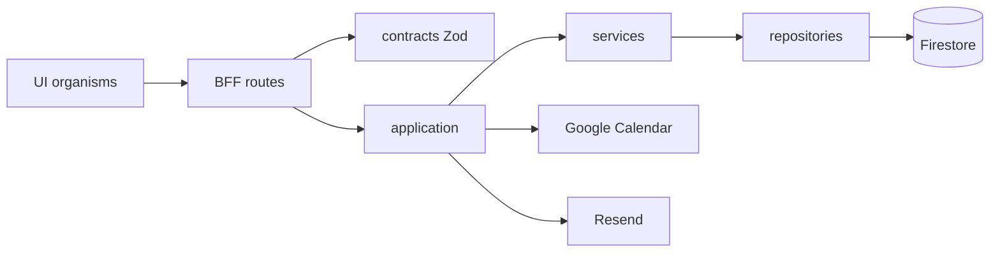

# Yelena Booking

[](https://github.com/erickorso/yelena-booking/actions/workflows/ci.yml)

**Clinic booking + light EHR** for specialists and patients: public directory, role dashboards, Google Calendar / Meet sync, Resend mail, and per-specialist clinical custom fields — on a free-tier Firebase + Vercel stack.

By [Erick Vargas](https://github.com/erickorso) · Live: [yelena-booking.vercel.app](https://yelena-booking.vercel.app)

> Portfolio demo — not a certified medical device and not for real PHI in production without a compliance review.

---

## Product decisions

| Topic | Decision |
| --- | --- |
| **Auth** | Firebase Auth (email/password + Google) + **custom claims** (`paciente` \| `especialista` \| `admin`) |
| **DB** | Cloud Firestore (Admin SDK only in BFF) |
| **Files** | Vercel Blob (private) + `medicalFiles` metadata — Spark-friendly vs Firebase Storage |
| **Calendar** | Specialist Google OAuth → FreeBusy slots + Meet on book |
| **Mail** | Resend templates (best-effort after commit) |
| **i18n / theme** | `next-intl` ES/EN · `next-themes` light/dark |
| **Public** | Landing, specialist directory, auth |
| **Private** | `/dashboard/*` by role (patient / specialist / admin / pending) |

---

## Architecture

```text
Browser (Next.js App Router + AuthProvider)
   │  Bearer ID token on /api/*
   │  soft session cookie → edge gate for /dashboard
   ▼
BFF route handlers (Zod contracts + x-request-id)
   → application use-cases (e.g. bookAppointment)
      → services → repositories (Admin) → Firestore / Blob
      → side-effects: Google Calendar · Resend (saga)
```

Route handlers stay thin: authenticate, validate, call one use-case, map errors. Domain authz uses **capabilities** (`book_self`, `book_on_behalf`, …) so one user can act as patient and specialist without ad-hoc role soup.

Full notes: [`docs/ARCHITECTURE.md`](./docs/ARCHITECTURE.md) · engineering standards: [`PROJECT_CONTEXT.md`](./PROJECT_CONTEXT.md).



### Consistency (booking saga)

1. **Commit** appointment in Firestore (source of truth).
2. **Best-effort** Google Calendar + Meet.
3. **Best-effort** confirmation email.

API returns `200` with `googleSynced` / `mailSent` flags when side-effects fail — no fake distributed transaction.

### Layers (folder map)

```text
src/
  app/[locale]/          # UI + i18n
  app/api/               # BFF
  application/           # use-cases (authz + orchestration)
  contracts/             # Zod shared API↔UI shapes
  components/            # atoms → templates (Atomic Design)
  services/              # single-aggregate logic
  repositories/          # Firestore Admin + stubs
  adapters/firestore/    # raw docs → domain
  types/domain/          # models, roles, capabilities
  lib/http/              # requestId + JSON helpers
  lib/observability/     # logServer + reportError (Sentry hook)
  middleware.ts          # next-intl + soft dashboard gate
```

---

## Roles

| Claim | Who |
| --- | --- |
| _(guest)_ | Landing + public directory |
| `paciente` | Book / own history & files |
| `especialista` | Agenda, chart, custom clinical fields (`pending` until admin approves) |
| `admin` | Approvals & governance (seed only) |

**TE code** search (with/without dashes) across clinic, admin, archives, and transfer flows.

---

## Accessibility & UX quality

- Skip link → `<main>`; toast region as `role="alert"`.
- Combobox (`SearchableSelect`): keyboard + `aria-activedescendant` + deferred filter.
- Tabs: Home/End; calendar days keyboard-reachable.
- Prefer `startTransition` / `useDeferredValue` on search-heavy panels.

---

## Observability

| Piece | Role |
| --- | --- |
| `x-request-id` | Stamped in middleware + echoed on API JSON errors |
| `logServer` | One JSON line per event (Vercel drains) |
| `reportError` | Client/server hook; ready for `SENTRY_DSN` |

---

## Stack

Next.js 16 · React 19 · TypeScript strict · Tailwind v4 · Firebase Auth/Firestore · Vercel Blob · Google APIs · Resend · Zod · next-intl · Vitest · Playwright

---

## Setup

```bash
npm install
cp .env.example .env.local   # fill Firebase, Blob, optional Google/Resend
npm run seed
npm run dev
```

Open [http://localhost:3000/es](http://localhost:3000/es).

### Demo accounts (seed)

| Role | Email | Password |
| --- | --- | --- |
| Admin | `admin@yelena.app` | `YelenaAdmin123!` |
| Patient | `paciente@yelena.app` | `YelenaPatient123!` |
| Specialist (active) | `especialista@yelena.app` | `YelenaSpecialist123!` |
| Specialist (pending) | `especialista.pending@yelena.app` | `YelenaSpecialist123!` |

Also listed in [`SEED_ACCOUNTS.md`](./SEED_ACCOUNTS.md).

### Required env (summary)

- `NEXT_PUBLIC_FIREBASE_*` + `FIREBASE_ADMIN_*` (service account)
- `BLOB_READ_WRITE_TOKEN` (+ store id if used)
- Optional: `GOOGLE_CLIENT_ID` / `GOOGLE_CLIENT_SECRET`, Resend keys, `SENTRY_DSN`

Paste [`firestore.rules`](./firestore.rules) into the Firebase console. Google OAuth redirect: `https://<host>/api/integrations/google/callback` (and localhost in dev).

---

## Scripts

| Command | Purpose |
| --- | --- |
| `npm run dev` | Dev server |
| `npm run build` | Production build |
| `npm run typecheck` | `tsc --noEmit` |
| `npm run lint` | ESLint |
| `npm test` / `test:coverage` | Vitest (+ gate) |
| `npm run test:e2e` | Playwright |
| `npm run seed` | Demo users + claims + docs |

---

## Quality checks

Every push/PR to `main` runs [CI](.github/workflows/ci.yml): **typecheck · lint · coverage thresholds · build · Playwright**.

Coverage include is a deliberate whitelist of domain, contracts, auth helpers, and services — thresholds sit just under current numbers so churn passes but regressions fail the build. Ops notes: [`docs/OPS_QUALITY.md`](./docs/OPS_QUALITY.md).

```bash
npm run typecheck
npm run lint
npm run test:coverage
npm run build
npm run test:e2e
```

---

## Deploy (Vercel)

1. Import [erickorso/yelena-booking](https://github.com/erickorso/yelena-booking).
2. Same env vars as `.env.local` (Production + Preview).
3. Optional Actions secrets: `VERCEL_TOKEN`, `VERCEL_ORG_ID`, `VERCEL_PROJECT_ID`.

---

## Useful routes

| Path | Use |
| --- | --- |
| `/es` `/en` | Landing |
| `/es/login` `/es/register` | Auth |
| `/es/specialists` | Active directory |
| `/es/dashboard/*` | Role panels |

---

## License

Portfolio / private use — see repo visibility on GitHub.
